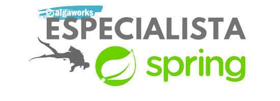

  

<h2 align="center">
  API - AlgaFood
</h2>

  
  
  
  
  
  

  <a href="#link-links">Links</a>&nbsp;&nbsp;&nbsp;|&nbsp;&nbsp;&nbsp;
  <a href="#open_file_folder-recursos">Recursos</a>&nbsp;&nbsp;&nbsp;|&nbsp;&nbsp;&nbsp;
  <a href="#rocket-tecnologias">Tecnologia</a>&nbsp;&nbsp;&nbsp;|&nbsp;&nbsp;&nbsp;
  <a href="#memo-licença">Licença</a>

---

API desenvolvida no treinamento em back-end, sobre REST APIs com Spring na Algaworks.

### :link: Links

- ##### URL
  - API= não hospedada :(

### :open_file_folder: Recursos

- ##### Postman Collection
  - [Download](./src/main/resources/static/AlgaFood.postman_collection.json)

| **Recurso** | **GET** | **POST** | **PUT** | **DELETE** |
|---|---|---|---|---|
| /cozinhas | ✔️ | ✔️ | ✔️ | ✔️ |
| /restaurante | ✔️ | ✔️ | ✔️ | ❌ |
| /estado | ✔️ | ✔️ | ✔️ | ✔️ |
| /cidade | ✔️ | ✔️ | ✔️ | ✔️ |

### :rocket: Tecnologias

- [JAVA](https://www.java.com)
  - [Lombok](https://projectlombok.org)
  - [Flyway](https://flywaydb.org)
- [Spring](https://spring.io)
- [MySql](https://www.mysql.com)

### :memo: Licença
Este projeto está sob a licença MIT. Veja a [licença](https://github.com/tiquinhonew/algafood-api/blob/master/LICENSE) para mais informações.

---

Douglas Moraes

