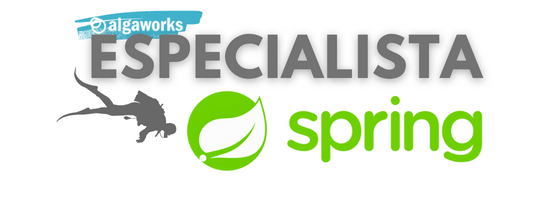

<p align="center"></p>
<h2 align="center">API - AlgaFood</h2>
<p align="center">
  
  <a href="https://www.codacy.com/gh/tiquinhonew/algafood-api/dashboard?utm_source=github.com&amp;utm_medium=referral&amp;utm_content=tiquinhonew/algafood-api&amp;utm_campaign=Badge_Grade"></a>
  
  
  
  
</p>
<p align="center">
  <a href="#link-links">Links</a>&nbsp;&nbsp;&nbsp;|&nbsp;&nbsp;&nbsp;
  <a href="#open_file_folder-recursos">Recursos</a>&nbsp;&nbsp;&nbsp;|&nbsp;&nbsp;&nbsp;
  <a href="#rocket-tecnologias">Tecnologia</a>&nbsp;&nbsp;&nbsp;|&nbsp;&nbsp;&nbsp;
  <a href="#%EF%B8%8F-deploy">Deploy</a>&nbsp;&nbsp;&nbsp;|&nbsp;&nbsp;&nbsp;
  <a href="#memo-licença">Licença</a>
</p>

---

API desenvolvida no treinamento em back-end, sobre REST APIs com Spring na Algaworks.

### :link: Links

- #### URL

  - API= não hospedada :(

### :open_file_folder: Recursos

- #### Postman Collection

  - [Download](./src/main/resources/static/AlgaFood.postman_collection.json)

| **Recurso** | **GET** | **POST** | **PUT** | **DELETE** |
|---|---|---|---|---|
| /cozinhas | ✔️ | ✔️ | ✔️ | ✔️ |
| /restaurante | ✔️ | ✔️ | ✔️ | ❌ |
| /estado | ✔️ | ✔️ | ✔️ | ✔️ |
| /cidade | ✔️ | ✔️ | ✔️ | ✔️ |

### :rocket: Tecnologias

[](https://www.java.com) [](https://spring.io) [](https://www.mysql.com) [](https://www.docker.com)

### 🏗️ Deploy

Antes de realizar o deploy do projeto, na raiz rode:

```bash
   docker compose up -d 
```

### :memo: Licença

Este projeto está sob a licença MIT. Veja a [licença](https://github.com/tiquinhonew/algafood-api/blob/master/LICENSE) para mais informações.

---

Douglas Moraes

[](https://www.linkedin.com/in/douglasam)
